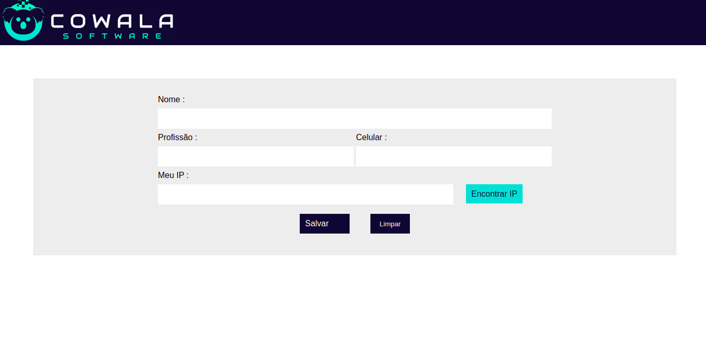

# Projeto HTML para Salvar um formulario

## Detalhes

Nesse projeto Fiz um formulario que salva localmente os dados inseridos. Além de pegar o Ip local atravez de uma [API](https://ip-fast.com/api/ip/).

## Informações

Para me ver desenvolvendo Projetos como esse basta me seguir no [Instagram](https://instagram.com/kaio_dev)

Caso queira entra em contato comigo, aqui esta meu [Linkedin](https://www.linkedin.com/in/kaio-rodrigo-8392a421a/)
